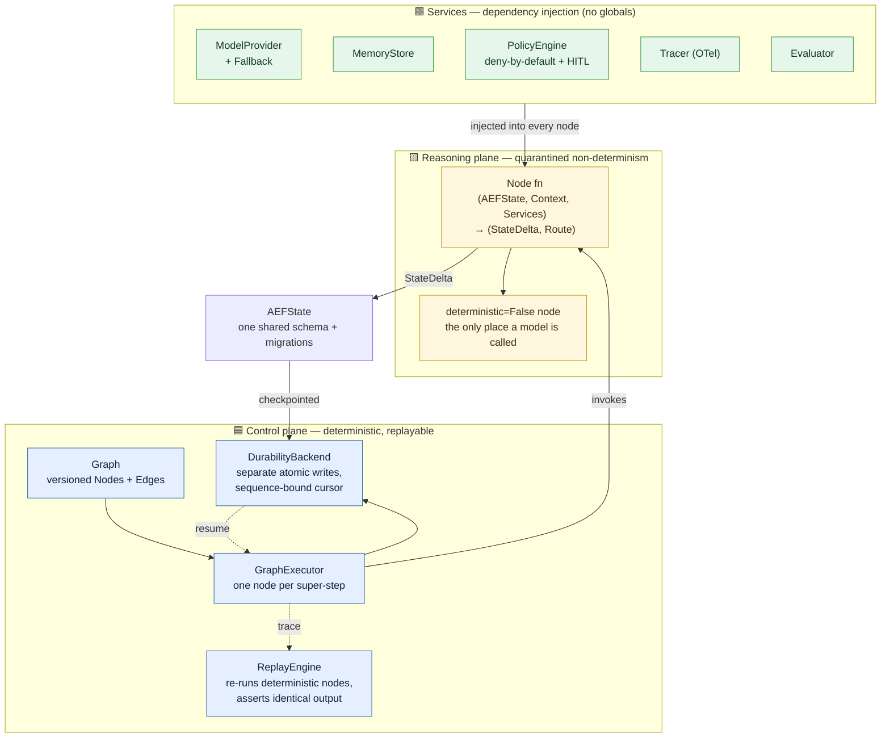
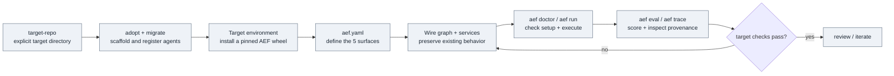

<div align="center">

# aef-core

### Agent Engineering Foundation — graph runtime and repository integration toolkit

*Integrate graph execution, memory, evaluation, security, and observability into a new repository or one with existing agents. Keep the repository's instructions; wire and test its behavior explicitly.*


[](https://github.com/AndrewGoodson/aef-core/actions/workflows/ci.yml)


For **Claude · Codex · Grok · Cursor · GitHub Copilot** workflows and Python agents.

</div>

---

## What it is

**Learning quality is not proven.** In one measured owner-repository trial,
the generated lesson made an agent worse, while a placebo performed better.
The [trial and its limitations](docs/adr/0204-the-loop-on-a-repo-somebody-uses-and-the-bullet-that-made-it-worse.md)
are part of this project's evidence. Passing infrastructure tests does not
establish that advice improves a target agent.

The [2026-09-11 repository review](docs/model-checks/2026-09-11-repository-review.md)
records integration fixes, validation, scale measurements and compatibility
limits. Its [executable goal](REPOSITORY_REVIEW_GOAL.md) defines the release scope.

Most agent code tangles two very different things together: the **deterministic
plumbing** (routing, state, retries, checkpoints, audit) and the
**non-deterministic reasoning** (the LLM calls). aef-core separates them into
two planes and never lets them mix:

- **Control plane** — a small, pure graph kernel. Sequencing, routing,
  checkpointing, and replay are ordinary bookkeeping with zero model calls.
  Fully deterministic and replayable.
- **Reasoning plane** — every LLM / non-deterministic call is quarantined
  inside a node explicitly declared `deterministic=False`.

The runtime supplies a shared state schema, checkpoint/resume durability,
a deny-by-default tool policy with human-in-the-loop gates, memory,
OpenTelemetry tracing, and an evaluation harness. Adoption writes the setup;
the target's graph and services must use those components to receive their
behavior. **Only five things differ per agent:**

> **Knowledge · Policies · Tools · Objectives · Evaluation Metrics**

If you find yourself adding an agent-specific branch anywhere else, the
abstraction is wrong, not the agent.

---

## Architecture at a glance



**The node contract is fixed and non-negotiable:**

```python
(AEFState, Context, Services) -> tuple[StateDelta, Route]
```

Nodes take everything via `Services` (dependency injection) — no globals, no
env reads, no self-constructed clients. Each node declares `deterministic`
(the replay engine *enforces* it) and `side_effects` (anything non-pure needs
an `idempotency_key_fn`).

---

## How to use it

### Point the command at your target

Open your coding agent in this AEF checkout, then name an **existing absolute
directory**. Quote paths containing spaces:

| Harness | Invoke |
|---|---|
| Claude Code / Grok | `/target-repo "/absolute/path/to/your repo"` |
| Codex | `$target-repo "/absolute/path/to/your repo"`, or select `target-repo` through `/skills` where supported |

The skill scaffolds the target, discovers eligible existing agents, then guides
the coding agent through the applicable wiring and tests **in that target**.
The source checkout stays read-only during the invocation. A fresh repo gets
an adapter stub; a repo with native Claude/Grok Markdown or Codex TOML personas
gets graph registrations. Neither result alone proves a working integration.

The mechanical phase also works from a terminal:

```sh
python3 -I -B /absolute/path/to/aef-core/scripts/target_repo.py '/absolute/path/to/your repo'
```

Prepare AEF's Python environment once, before invoking the command. The launcher
uses that existing environment and does not install dependencies into the source.
Its default is **offline**: no model provider and no generated scheduled
workflows. Model configuration requires `--profile model`; scheduled workflows
require the additional `--with-workflows` flag. Existing target configuration
and workflows are preserved, so these flags do not convert an old installation.

See the **[target-repo guide](docs/target-repo.md)** for setup, supported agent
formats, source-integrity checks, and updating an already integrated repo.



### Try the runtime locally

Run these commands in the AEF checkout as a separate setup/development step.
The included example uses a local echo provider; it needs no model credentials.

```bash
python3 -m venv .venv
source .venv/bin/activate
python -m pip install -e ".[dev]"
python -m examples.hello_agent.main
```

For a target repository, install a pinned wheel into its own environment as
described in its generated guide. An editable install pointing back to this
checkout does not provide source isolation.

### The five per-agent surfaces (`aef.yaml`)

| Surface | Where | What it is |
|---|---|---|
| **Objectives** | `objectives:` | what the agent is for |
| **Tools** | `tools.allow` | which capabilities it may call |
| **Policies** | `policies:` | risk threshold + HITL + forbidden tools |
| **Knowledge / Memory** | `memory:` | which memory backend |
| **Evaluation Metrics** | `evaluator.suites` | how a run is scored |

### AEF development checks

Use AEF's virtual environment. Adopting repositories run their own checks and
graph regressions; these source-tree commands are for changes to AEF itself.

```bash
pytest -q                          # tests
mypy --strict aef                  # types
ruff check .                       # lint
ruff format --check aef tests examples   # format
```

---

## Cross-harness support

aef-core is harness-agnostic — the scaffold is plain Python + the `aef` CLI.
`aef adopt` emits a native entry file for each major coding agent, all
resolving to one canonical guide (`AGENT_INTEGRATION.md`):

| Agent | Reads |
|---|---|
| Claude / Claude Code | `CLAUDE.md` |
| OpenAI Codex | `AGENTS.md` |
| Grok | `GROK.md` (portable guide; load it explicitly unless your harness documents automatic discovery) |
| GitHub Copilot | `.github/copilot-instructions.md` |
| Cursor | `.cursor/rules/aef.mdc` |

---

## What is implemented

| Phase | Status | Contents |
|---|---|---|
| **Phase 0 — Foundation** | ✅ Real & tested | Graph kernel, `AEFState` + migrations, checkpoint/replay, provider + fallback, OTel tracing |
| **Phase 1 — Durability & Services** | ✅ Real & tested | File durability, memory (`InMemory` + Mem0), security policy engine, eval harness, the CLI |
| **Retrieval and reflection** | Implemented; quality requires measurement | Memory-backed context retrieval, rule-based reflection and evidence consolidation. LLM reflection exists but is off by default; prior A/Bs have not shown a task-metric gain |
| **Integration** | Scaffolding + mechanical migration | Preserved owner instructions, profile-specific setup, native persona registrations, and supported Python call-site wrappers. Tool semantics, domain checks and complex call sites require target-specific work |
| **Planning and optimization** | Limited / absent | No knowledge-graph service, planner or token-optimizer implementation. Offline optimization remains a typed interface raising `NotImplementedError` |
| **Phase 4 — Evolution** | 🔒 Built but gated | Self-modification interfaces exist and are hard-disabled in code (`EvolutionConfig(enabled=True)` raises) |

See [the roadmap](docs/roadmap.md) for the authoritative component status.

## What improves itself, and what does not

**The built-in loop does not automatically merge changes to AEF or its agents.**

The self-rewiring loop proposes changes to the agents aef-core **hosts**.
Its gates limit accepted candidate changes to `agents/**` (Zone A) by default;
the harness and kernel belong to protected Zones B and C. Diff validation is
not filesystem isolation for arbitrary candidate code: execution containment
needs a separately configured sandbox. The supplied CI workflow prepares AEF
from trusted `main`, fetches the candidate as data, then evaluates inside a
container with networking disabled. See [ADR 0211](docs/adr/0211-prepare-workflows-before-isolated-evaluation.md)
for setup and runner restrictions. Local callers
must provide the same trusted-launch provenance; `BaseRefHarness` is an
explicit-read utility, not the loop driver's loader (ADR 0047).

Letting the loop improve its own harness would mean letting it rewrite its
own judge. That is the one thing the entire safety design exists to prevent.

The model profile can add an owner-configured loop kit. Scheduled workflows
are generated only with `--with-workflows`; adopting a repo does not start
a learning service or establish that its evaluation corpus is adequate.
Candidate merges, harness changes and corpus tripwire labels require a human.

**Tier-1 auto-merge is off and cannot be turned on from a flag, a config key,
or an environment variable.** Enabling it is a deliberate source change. Every
candidate that passes all six gates is escalated to a human, phrased as a
decision rather than a diff.

So aef-core gets better the way any repo does: a person runs it. What
compounds over time is not autonomy but **evidence** — a hash-chained ledger,
a corpus with tripwires that a future model cannot quietly regress past, and
ADRs recording what was tried and what was wrong. A new model can inspect that
evidence and test whether a proposed change helps.

Every design decision and deviation is recorded as a numbered ADR in
[`docs/adr/`](docs/adr/README.md).

---

## Autonomous self-improving loop

aef-core is developed with, and ships, a codified autonomy protocol
([`docs/autonomy/self-improving-loop.md`](docs/autonomy/self-improving-loop.md)):
**audit by adversarial construction → reproduce → fix → verify → ADR → commit →
repeat until a bounded work-list is done.** It runs unattended, pausing only at
explicit **HARD-STOP gates**:

1. Any push to another repo, or any external publish.
2. Enabling `aef/evolution/`, weakening the `PolicyEngine`, or removing a HITL gate.
3. Deleting or overwriting an existing user file.
4. A breaking public-contract change the agent isn't confident about.

Learning starts with recorded outcomes and reflections. A lesson is a candidate
claim until independent target checks support it. Prompt changes need controlled
evaluation against the incumbent and a placebo; tool-dependent personas need
real tool execution, never imagined tool results. The evolution engine stays
gated by design. See the [evidence-learning protocol](docs/autonomy/evidence-learning.md).

---

## Hand it to your AI

Use the target command above for integration. To continue inside an already
integrated target, give your coding agent this bounded request:

```text
Read this target's owner instructions, AGENT_INTEGRATION.md, AUTONOMY.md,
and AEF_MIGRATION_CHECKLIST.md. Review preserved configuration before changing
it. Keep all implementation, environments, logs and reports in this target;
leave the AEF source checkout unchanged.

Establish the target's existing test baseline, then complete one applicable
graph integration using its real tools and independent domain checks. Use an
installed, pinned AEF wheel. Keep the offline profile unless model execution
is needed and authorized. Preserve native agent instructions and behavior.

Prove success, failure, tool-policy denial, checkpoint/resume and deterministic
replay where applicable. Record evidence and remaining limits. Do not infer
learning gains from a passing scaffold or promote untested advice. Keep HITL,
evolution disablement and human candidate promotion intact. Stop once the
bounded integration and verification are done; report the actual result.
```

---

## Documentation map

| File | Purpose |
|---|---|
| [`docs/target-repo.md`](docs/target-repo.md) | Target command, existing-agent support, safe reruns and source preservation |
| [`AGENT_INTEGRATION.md`](AGENT_INTEGRATION.md) | Canonical ingest-and-start guide for any agent |
| [`CLAUDE.md`](CLAUDE.md) / [`AGENTS.md`](AGENTS.md) | The scaffold contract + non-negotiable constraints |
| [`docs/autonomy/self-improving-loop.md`](docs/autonomy/self-improving-loop.md) | The autonomy protocol + HARD-STOP gates |
| [`docs/autonomy/new-repo-bootstrap-loop.md`](docs/autonomy/new-repo-bootstrap-loop.md) | Copy-paste prompt to bootstrap a new adopting repo |
| [`docs/roadmap.md`](docs/roadmap.md) | Authoritative real-vs-stubbed status, phase by phase |
| [`docs/adr/README.md`](docs/adr/README.md) | Every design decision, with rationale |
| [`docs/autonomy/evidence-learning.md`](docs/autonomy/evidence-learning.md) | Evidence, lessons and the checks needed before reuse |
| [`docs/trust/promotion-trust-case.md`](docs/trust/promotion-trust-case.md) | Why automatic promotion remains disabled |
| [`docs/design/self-rewiring/`](docs/design/self-rewiring/03-roadmap.md) | Design rationale for the implemented loop and its remaining evidence gaps |

---

<div align="center">

**License:** MIT · **Python:** 3.11+ · Built two planes at a time.

</div>
