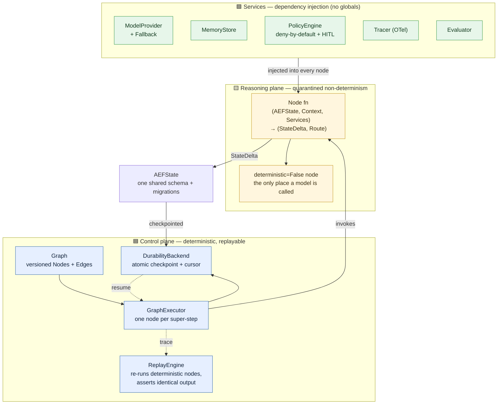
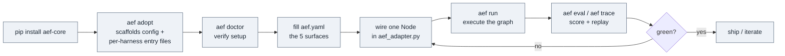

<div align="center">

# aef-core

### Agent Engineering Foundation — a repo-agnostic Agent Operating System scaffold

*Drop it into any repo and your agents inherit planning, graph execution, durable memory, evaluation, security, and observability — without rebuilding any of it per agent.*


Works with **Claude · Codex · Cursor · GitHub Copilot** — or any coding agent that writes Python.

</div>

---

## What it is

Most agent code tangles two very different things together: the **deterministic
plumbing** (routing, state, retries, checkpoints, audit) and the
**non-deterministic reasoning** (the LLM calls). aef-core separates them into
two planes and never lets them mix:

- **Control plane** — a small, pure graph kernel. Sequencing, routing,
  checkpointing, and replay are ordinary bookkeeping with zero model calls.
  Fully deterministic and replayable.
- **Reasoning plane** — every LLM / non-deterministic call is quarantined
  inside a node explicitly declared `deterministic=False`.

Everything an agent needs — a shared state schema, checkpoint/resume
durability, a deny-by-default security policy with human-in-the-loop gates,
memory, OpenTelemetry tracing, and an evaluation harness — is inherited from
the scaffold. **Only five things differ per agent:**

> **Knowledge · Policies · Tools · Objectives · Evaluation Metrics**

If you find yourself adding an agent-specific branch anywhere else, the
abstraction is wrong, not the agent.

---

## Architecture at a glance



**The node contract is fixed and non-negotiable:**

```python
(AEFState, Context, Services) -> tuple[StateDelta, Route]
```

Nodes take everything via `Services` (dependency injection) — no globals, no
env reads, no self-constructed clients. Each node declares `deterministic`
(the replay engine *enforces* it) and `side_effects` (anything non-pure needs
an `idempotency_key_fn`).

---

## How to use it



### Quickstart

```bash
# 1. Install (add [anthropic]/[mem0] extras only when wiring those backends)
pip install -e ".[dev]"

# 2. Scaffold into your repo — never overwrites an existing file
aef adopt

# 3. Verify
aef doctor

# 4. Run the included example end-to-end
python -m examples.hello_agent.main
```

### The five per-agent surfaces (`aef.yaml`)

| Surface | Where | What it is |
|---|---|---|
| **Objectives** | `objectives:` | what the agent is for |
| **Tools** | `tools.allow` | which capabilities it may call |
| **Policies** | `policies:` | risk threshold + HITL + forbidden tools |
| **Knowledge / Memory** | `memory:` | which memory backend |
| **Evaluation Metrics** | `evaluator.suites` | how a run is scored |

### The green bar (every change must pass all four)

```bash
pytest -q                          # tests
mypy --strict aef                  # types
ruff check .                       # lint
ruff format --check aef tests examples   # format
```

---

## Cross-harness support

aef-core is harness-agnostic — the scaffold is plain Python + the `aef` CLI.
`aef adopt` emits a native entry file for each major coding agent, all
resolving to one canonical guide (`AGENT_INTEGRATION.md`):

| Agent | Reads |
|---|---|
| Claude / Claude Code | `CLAUDE.md` |
| OpenAI Codex | `AGENTS.md` |
| GitHub Copilot | `.github/copilot-instructions.md` |
| Cursor | `.cursor/rules/aef.mdc` |

---

## What's real vs. what's declared

| Phase | Status | Contents |
|---|---|---|
| **Phase 0 — Foundation** | ✅ Real & tested | Graph kernel, `AEFState` + migrations, checkpoint/replay, provider + fallback, OTel tracing |
| **Phase 1 — Durability & Services** | ✅ Real & tested | File durability, memory (`InMemory` + Mem0), security policy engine, eval harness, the CLI |
| **Phase 3 — Reflection** | 🟡 Partially real | `RuleBasedCritic`/`RuleBasedJudge` + `make_reflect_node` write failure/success memory from a real run, grounded only in recorded signals (ADR 0046). LLM-backed critic/judge still stubbed |
| **Phase 2/3/5** | 🧩 Typed stubs | Knowledge graph, context engine, token optimizer, planner, offline optimization, coordination — real interfaces, `NotImplementedError` bodies, **no fake behavior** |
| **Phase 4 — Evolution** | 🔒 Built but gated | Self-modification interfaces exist and are hard-disabled in code (`EvolutionConfig(enabled=True)` raises) |

Every design decision and deviation is recorded as a numbered ADR in
[`docs/adr/`](docs/adr/README.md) (40 and counting).

---

## Autonomous self-improving loop

aef-core is developed with, and ships, a codified autonomy protocol
([`docs/autonomy/self-improving-loop.md`](docs/autonomy/self-improving-loop.md)):
**audit by adversarial construction → reproduce → fix → verify → ADR → commit →
repeat until a bounded work-list is done.** It runs unattended, pausing only at
explicit **HARD-STOP gates**:

1. Any push to another repo, or any external publish.
2. Enabling `aef/evolution/`, weakening the `PolicyEngine`, or removing a HITL gate.
3. Deleting or overwriting an existing user file.
4. A breaking public-contract change the agent isn't confident about.

"Self-learning" here means writing reflections into memory — **not**
self-modification. The evolution engine stays gated by design.

---

## Hand it to your AI

Open your coding agent in this repo (or a repo you've run `aef adopt` in) and
paste:

```text
You are taking over an aef-core project. Do this in order, autonomously,
stopping only at the HARD-STOP gates you'll find in AUTONOMY.md:

1. Read AGENT_INTEGRATION.md and AUTONOMY.md in full — they are the contract.
   (Not in this repo yet? Run `aef adopt` first; it writes them.)
2. Establish the green bar and confirm it passes as-is:
     pytest -q
     mypy --strict aef
     ruff check .
     ruff format --check aef tests examples
3. Fill in aef.yaml's five surfaces (objectives, tools.allow, policies,
   memory, evaluator.suites) for the agent I'm building.
4. Wire ONE node with the fixed signature
   (AEFState, Context, Services) -> tuple[StateDelta, Route], everything via
   Services — no globals, no env reads. Vendor SDK imports only under
   aef/providers/ or aef/services/*/adapters/. Declare `deterministic`
   honestly; a non-pure node needs an idempotency_key_fn. Prove it with
   `aef run` then `aef eval` / `aef trace`.
5. From then on, work the bounded self-improving loop
   (docs/autonomy/self-improving-loop.md): for each item — write a failing
   test that reproduces the need, implement, pass the green bar, write an ADR
   if it's a real behavior change, commit, push to THIS repo only. When the
   work-list is done, STOP and summarize.

Reproduce before you fix. Never enable aef/evolution/. Never weaken the
PolicyEngine or remove a HITL gate. Never overwrite a user file.
```

---

## Documentation map

| File | Purpose |
|---|---|
| [`AGENT_INTEGRATION.md`](AGENT_INTEGRATION.md) | Canonical ingest-and-start guide for any agent |
| [`CLAUDE.md`](CLAUDE.md) / [`AGENTS.md`](AGENTS.md) | The scaffold contract + non-negotiable constraints |
| [`docs/autonomy/self-improving-loop.md`](docs/autonomy/self-improving-loop.md) | The autonomy protocol + HARD-STOP gates |
| [`docs/autonomy/new-repo-bootstrap-loop.md`](docs/autonomy/new-repo-bootstrap-loop.md) | Copy-paste prompt to bootstrap a new adopting repo |
| [`docs/roadmap.md`](docs/roadmap.md) | Authoritative real-vs-stubbed status, phase by phase |
| [`docs/adr/README.md`](docs/adr/README.md) | Every design decision, with rationale |
| [`docs/design/self-rewiring/`](docs/design/self-rewiring/03-roadmap.md) | Planning program: owner-gated self-rewiring agents (design only) |

---

<div align="center">

**License:** MIT · **Python:** 3.11+ · Built two planes at a time.

</div>
