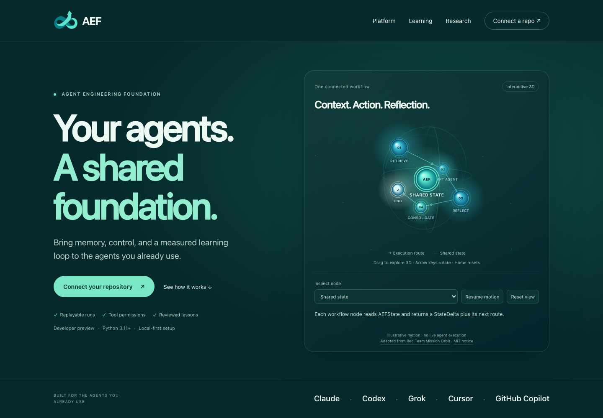

<div align="center">


# AEF

### Your agents. A shared foundation.

Bring memory, control, and a measured learning loop to the agents you already use.

**[Explore AEF ↗](https://andrewgoodson.github.io/aef-core/)** &nbsp; · &nbsp; **[Connect your repository](#connect-your-repository)** &nbsp; · &nbsp; **[Documentation](AGENT_INTEGRATION.md)**

Claude · Codex · Grok · Cursor · GitHub Copilot

[](https://andrewgoodson.github.io/aef-core/)

Agent Engineering Foundation · Developer preview · Python 3.11+ · MIT

</div>

## A foundation for the way your agents work

AEF connects agent workflows through a shared graph runtime. Routing, state,
checkpoints and audit stay explicit. Model calls happen inside nodes with
clearly declared boundaries. Each repository supplies its own knowledge,
policies, tools, objectives and evaluation metrics.

| Keep work connected | Stay in control | Learn with evidence |
|---|---|---|
| Bring relevant memory into a run. Checkpoint progress, resume interrupted work and replay deterministic steps. | Define tool permissions, require human approval for risky calls and retain an audit trail. | Capture outcomes, propose bounded lessons and compare them against independent checks before human review. |

AEF provides the components and integration workflow. Your target's graph must
use those components, connect real tools and pass domain tests. Setup alone
does not establish agent behavior or learning gains.

## Connect your repository

Start with a new project or a repository that already has agents.
**`/target-repo` selects where the integration happens.** Your existing owner
instructions stay in place; the prepared AEF source stays read-only during
invocation.

### 1. Prepare AEF once

Clone the repository and install its development environment:

```sh
git clone https://github.com/AndrewGoodson/aef-core.git
cd aef-core
python3 -m venv .venv
.venv/bin/python -m pip install -e '.[dev]'
```

The product is **AEF**. Its repository and Python distribution retain the
technical name `aef-core`. This initial setup writes to the AEF checkout.

### 2. Point AEF at your target

Open Claude Code or Grok in the prepared AEF checkout, then run:

```text
/target-repo "/absolute/path/to/your repo"
```

In **Codex**, invoke the same repository skill with:

```text
$target-repo "/absolute/path/to/your repo"
```

Codex also exposes skills through `/skills` where supported. If a skill is
missing, refresh your agent session in the AEF checkout.

Use an existing local directory and quote its full absolute path. To enhance a
repository hosted on GitHub, clone it first and pass that directory. The target
must be separate from the AEF source; neither directory may contain the other.

### 3. Wire one workflow. Verify the result.

The skill scaffolds configuration, discovers eligible agents and guides the
coding agent through integration and tests in the target. All implementation,
environments, logs and reports belong there. Source-integrity checks compare
the AEF checkout before and after invocation.

Install a pinned AEF wheel into the target's own environment. Connect actual
services and tools, establish the target's test baseline, then exercise success,
failure, policy denial and durability where applicable. A graph registration
is the starting point; these checks establish what works.

**Offline by default.** No model provider or scheduled workflows are generated
by the default profile. Model-backed personas need explicit provider setup and
authorized execution. Tool-dependent personas need real tool results.

[Full integration guide →](docs/target-repo.md)

<details>
<summary><strong>Use AEF from the terminal</strong></summary>

Run the mechanical phase from any directory:

```sh
python3 -I -B /absolute/path/to/aef-core/scripts/target_repo.py '/absolute/path/to/your repo'
```

The launcher uses AEF's prepared environment and installs nothing into the
source. It scaffolds and registers eligible agents; semantic wiring and target
tests still require a coding agent or developer. Model configuration requires
`--profile model`; scheduled workflows also require `--with-workflows`.
These flags preserve existing configuration rather than converting an older
installation. Review it before upgrading.

</details>

## Designed to fit the agents already in your repo

| Your starting point | The integration |
|---|---|
| A new repository | Configuration, onboarding guides and an adapter stub for your first graph. |
| Claude / Grok Markdown or eligible Codex TOML personas | Graph registrations that read native personas. Provider, tool semantics and domain behavior require explicit wiring. |
| Existing owner instructions and skills | Managed AEF guidance alongside preserved owner text; native skills are inventoried and remain native workflows. |
| An existing AEF integration | Missing outputs and refreshed valid managed blocks. Existing configuration, graphs and dependencies require review before an upgrade. |

Generated entry files support Claude, Codex, Grok, Cursor and GitHub Copilot.
Grok's portable `GROK.md` guide must be loaded explicitly unless the harness
documents automatic discovery. [Agent entry points →](AGENT_INTEGRATION.md#which-file-your-agent-reads)

## A learning loop you can inspect

**Observe → Propose → Compare → Review**

Record actual outcomes and failure evidence. Propose one bounded correction.
Compare it against the incumbent on independent held-out tasks, with placebo
controls where appropriate. Record harm, uncertainty and cost before a human
decides whether to keep the lesson.

**Learning quality remains unproven.** In one owner-repository trial, a generated
lesson reduced the score from **0.67 to 0.40**, while a meaningless placebo
scored **0.87**. These are historical task-specific results, not product
benchmarks. [Read the trial and its limitations →](docs/adr/0204-the-loop-on-a-repo-somebody-uses-and-the-bullet-that-made-it-worse.md)

AEF implements memory, retrieval, rule-based reflection and a gated candidate
review loop. Optional LLM reflection is off by default. The system does not
train model weights. **Evolution and automatic merging remain disabled.**

[Learning methodology](docs/graph-and-learning.md) ·
[Reusable learning instructions](docs/autonomy/evidence-learning.md) ·
[Autonomy boundaries](docs/autonomy/self-improving-loop.md)

## Clear about what ships

**Available:** graph execution, shared state, checkpoint/resume, deterministic
replay, policy and audit services, memory, context retrieval, evaluation,
OpenTelemetry tracing, rule-based reflection and gated candidate review.

**Requires target wiring:** domain behavior, real tool containment, model
providers, durable services and meaningful evaluations. Diff validation alone
does not isolate arbitrary candidate code; execution needs a configured sandbox.

**Unavailable or disabled:** executed fan-out, multi-agent coordination,
knowledge-graph service, general planner and token optimizer. Offline
optimization remains a typed interface; evolution and automatic promotion are
disabled.

[Component status and roadmap →](docs/roadmap.md)

## Go deeper

| Guide | Start here to… |
|---|---|
| [Agent integration](AGENT_INTEGRATION.md) | Install AEF, wire nodes and continue in a target repository. |
| [Target a repository](docs/target-repo.md) | Use the command, understand supported formats and review safe reruns. |
| [Graph and learning design](docs/graph-and-learning.md) | Understand the runtime, research references and evidence limits. |
| [New repository bootstrap](docs/autonomy/new-repo-bootstrap-loop.md) | Give a fresh coding agent a bounded integration prompt. |
| [Promotion trust case](docs/trust/promotion-trust-case.md) | Understand why candidate promotion requires human review. |
| [Architecture decisions](docs/adr/README.md) | Inspect the decisions and experiments behind AEF. |

<details>
<summary><strong>Develop AEF locally</strong></summary>

After setup, run the included example with its local echo provider. No model
credentials are needed:

```sh
.venv/bin/python -m examples.hello_agent.main
```

For changes to AEF itself, use its virtual environment and run:

```sh
source .venv/bin/activate
pytest -q
mypy --strict aef
ruff check .
ruff format --check aef tests examples
```

Read [AGENTS.md](AGENTS.md) for the node contract, vendor isolation and security
invariants. Target repositories run their own domain checks and graph
regressions. See the [website guide](site/README.md) for browser tests and
automatic GitHub Pages publication from this repository.

</details>

---

<div align="center">

**Bring it all together with AEF.**

[Connect your repository](#connect-your-repository) &nbsp; · &nbsp; [Explore the platform ↗](https://andrewgoodson.github.io/aef-core/)

</div>
