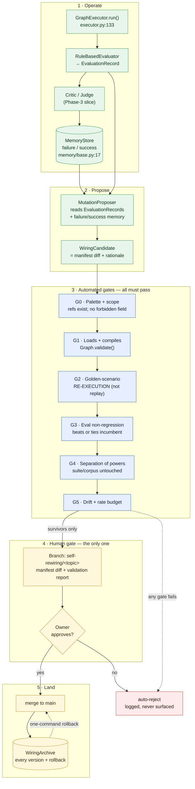

> **⚠ REVISED — read `04-review-and-self-coding-redesign.md` first.** Three-reviewer
> audit disproved this document's premise (edges authorize routes; nodes choose them)
> and found the gate pipeline admitted only no-ops. Scope is now self-coding with a
> structurally isolated harness (ADR 0044). Retained for provenance.

# Self-rewiring agents — 01: architecture

**Status:** planning artifact. No code accompanies this document.
**Reads on:** `00-current-state.md` (ground truth, cited `file:line`).

---

## 1. The problem this architecture must solve

An agent should propose changes to **its own graph wiring** — which nodes
run, in what order, under what conditions, with which prompts/params — and
those proposals must arrive as a **diff the owner can review** before
anything merges to `main`.

The blocker (`00-current-state.md` §1.1, G2): a `Graph` holds Python
callables (`Node.fn`, `Edge.condition`, `contracts.py:192-229`). It cannot
be serialized, so it cannot be archived, diffed as data, or rendered for
review. And no declarative graph spec or loader exists (G1,
`cli/run.py:67-70`).

Everything below follows from resolving that.

---

## 2. The core decision: a wiring manifest

**A graph's *wiring* is expressed as a declarative manifest that references
code by import path. The manifest — not the live `Graph` object — is the
artifact agents propose against, archives store, diffs render, and owners
review.**

```yaml
# wiring/my_agent.yaml   (illustrative shape, not a final schema)
graph:
  id: my_agent
  version: 1.4.0
  entry_node: draft
nodes:
  - id: draft
    version: 1.0.0
    fn: myagent.nodes:draft_node          # import ref — NOT code
    deterministic: false
    side_effects: pure
    params: { temperature: 0.7 }          # tunable payload
  - id: search
    version: 1.2.0
    fn: myagent.nodes:search_node
    deterministic: false
    side_effects: external_call
    idempotency_key_fn: myagent.keys:search_key
edges:
  - from: draft
    to: search
    condition: myagent.conditions:needs_search   # import ref
    priority: 10
  - from: draft
    to: summarize
    condition: myagent.conditions:always
    priority: 0
```

A **loader** resolves the import refs into real `Node`/`Edge` objects and
constructs a `Graph`, which then goes through the existing
`Graph.compile()` → `validate()` path unchanged (`graph.py:44-74`).

### 2.1 Why this is the right shape (three independent reasons)

1. **It makes the artifact real.** Serializable ⇒ archivable ⇒ diffable ⇒
   reviewable. It resolves G1, G2, G3, G9, and G10 in one move.
2. **It is a containment boundary, not just a format.** An agent may only
   reference `fn`s that **already exist and have already been reviewed by a
   human**. It can recombine vetted building blocks; it *cannot author new
   behaviour*. **Self-rewiring ≠ self-coding.** This is the single most
   important safety property of the design.
3. **It makes the owner's gate meaningful.** A YAML manifest diff is
   reviewable in seconds — "edge `draft→search` priority 10→0, condition
   `needs_search`→`always`" — where an arbitrary Python diff would not be.

### 2.2 What an agent may and may not change

| May change (wiring) | May **not** change |
|---|---|
| Add/remove/reorder edges | Author or edit any `fn` / `condition` source |
| Edge `condition` ref (from the existing palette) | Introduce a new import ref that doesn't already exist |
| Edge `priority`, `requires_human_approval` | The eval suite or golden corpus (Gate 4) |
| Add/remove a node from the palette; change `entry_node` | `deterministic` / `side_effects` declarations (safety metadata — owner-only) |
| Node `params` (prompts, temperature, budgets) | Anything under `aef/` itself |

The two "may not" rows on declarations matter: letting a proposer flip
`deterministic` or `side_effects` would let it route around replay
enforcement and the idempotency contract (`contracts.py:204-210`).

### 2.3 Manifest ↔ palette

The **palette** is the set of import refs a manifest may reference. It is
derived from what exists in the repo and is therefore human-controlled by
construction: adding a new node function is an ordinary, human-authored
code change on its own PR. A proposal referencing a ref outside the palette
is rejected before any other gate runs.

---

## 3. System overview



**Reading the diagram:** a candidate that fails any gate is auto-rejected
and **never reaches the owner** — that is what keeps the human gate from
degrading into a rubber stamp. Only survivors become a branch diff.

---

## 4. Components

### 4.1 `WiringManifest` + loader
- **In:** a YAML/JSON manifest. **Out:** a `Graph`.
- **Contract:** resolve each import ref; construct `Node`/`Edge`; return a
  `Graph` that then goes through the untouched `compile()`.
- **Failure modes:** unresolvable ref; ref outside the palette; a
  `side_effects != pure` node without `idempotency_key_fn` (already
  enforced at `contracts.py:204-210`); schema violation. All are hard
  rejects with the offending path named.
- **Also provides:** `Graph → manifest` extraction for the *incumbent*, so
  the archive can record what is currently live.

### 4.2 `WiringDiff`
- Structured, serializable diff **between two manifests** — not
  `GraphDiff`, which is in-memory-only and misses edge reorder and
  unversioned node changes (`00-current-state.md` §2, G3).
- Must express: added/removed/**modified** node or edge (with
  field-level before→after), `entry_node` change, and **order** changes.
- Renders to (a) a human-readable summary for the report and (b) the actual
  YAML diff the owner reads in the branch.

### 4.3 `MutationProposer`
- **In:** `EvaluationRecord`s across runs + `failure`/`success` memory
  (`memory/base.py:17-25`) + the current manifest + the palette.
- **Out:** zero or more `WiringCandidate`s = `(manifest diff, rationale,
  grounded_in)`, where `grounded_in` cites the specific records/lessons
  that motivated it. A proposal with no grounding is not a proposal.
- **First implementation is rule-based/heuristic** (reorder by observed
  failure rate; drop a node whose tool calls always error; retune a
  priority). An LLM-backed proposer is a later, clearly-bounded option and
  changes none of the gates.
- **DI:** injected via a new `Services` slot (G11) — the proposer is
  reasoning-plane, the gates are control-plane. The two-plane invariant
  holds: a proposer may be non-deterministic; **every gate is
  deterministic.**

### 4.4 The gate pipeline
Ordered, fail-fast, each specified in `gates/`. G0/G1 are cheap and run
first; G2 (re-execution over the corpus) is the expensive one.

### 4.5 `WiringArchive`
- Every manifest version stored immutably with its validation report and
  the diff that produced it; the archive **never shrinks** (mirrors
  criterion 3's discipline).
- `rollback(graph_id, version)` restores a prior manifest in one command.
- Substrate: reuse `_atomic_write_text` + per-run dir layout
  (`durability.py:34-61`), which already survives torn writes (ADR 0031).
- Note the existing `ArchiveStore` ABC (`engine.py:77-83`) is shaped for
  this but is a Phase-4 evolution stub; this program builds a **separate,
  non-evolution** archive rather than enabling that module.

### 4.6 Review surface
A surviving candidate produces: a branch `self-rewiring/<topic>`, the
manifest diff, and a **validation report** — what changed, why (grounded
citations), which gates passed with what numbers, and the eval delta. The
owner approves or rejects. **Only the owner merges to `main`.**

---

## 5. How this composes with existing invariants

| Invariant | How it is preserved |
|---|---|
| **Two-plane determinism** | The proposer is reasoning-plane and may be non-deterministic; every gate and the loader are deterministic control-plane. A candidate's *acceptance* never depends on a model call. |
| **Replay determinism** | Unchanged. `deterministic`/`side_effects` are owner-only fields (§2.2), so a proposal cannot relabel a node to escape replay enforcement. |
| **Vendor isolation** | Untouched — manifests reference app-level refs; no vendor SDK import moves. |
| **Security (deny-by-default, HITL)** | A proposal may set `requires_human_approval=True` on an edge but the palette/scope gate should treat *removing* an existing HITL edge flag as a high-risk change that is surfaced prominently in the report. `PolicyEngine` is untouched. |
| **Evolution stays gated** | This program builds no auto-promotion path. `EvolutionConfig`/`EvolutionSettings` disablement (`engine.py:48-55`, `schema.py:79-88`) is untouched. |

### 5.1 Relationship to the seven Phase-4 criteria
The owner's commit-review **replaces** unsupervised auto-promotion, which
is strictly stronger than criterion 7 and removes the need for criteria 1
(shadow execution) and 6 (canary) — no unattended live promotion occurs.
Criteria 3 (golden-trace regression), 4 (bounded mutation rate), and 5
(cumulative-drift) are genuinely load-bearing here and are carried in as
gates G2 and G5. Criterion 2 (null-hypothesis baseline) is recorded as an
**open question** (§7).

---

## 6. What this architecture deliberately does not do

- **No runtime self-modification.** Nothing rewires a *running* graph. A
  change takes effect only after the owner merges and the process reloads.
- **No new code authored by agents.** Palette-bounded (§2.2).
- **No auto-promotion.** There is exactly one promotion mechanism: the
  owner's merge.

---

## 7. Open questions for the owner

| # | Question | Why it matters |
|---|---|---|
| Q1 | Should the proposer be allowed to add a node function that does not yet exist (i.e. propose new code), in a later phase? | Would cross the self-rewiring→self-coding line; needs a separate safety design and much heavier diff review. **Recommendation: no, not in v1.** |
| Q2 | Is a null-hypothesis baseline (criterion 2 — beat a *randomized* mutation, not just the incumbent) required here? | It is the strongest anti-overfitting control, but costly: it needs many extra corpus runs. **Recommendation: defer to a later milestone; record the exposure in `02-risks.md`.** |
| Q3 | What is K for the bounded mutation rate (G5) — changes per graph per window? | Directly sets drift exposure and owner review load. |
| Q4 | Should removing an existing `requires_human_approval=True` edge flag be *forbidden* outright rather than merely flagged? | Forbidding is safer; flagging is more flexible. **Recommendation: forbid in v1.** |
| Q5 | Do manifests live in the agent's own repo (adopted repo) or in aef-core? | Affects where the archive lives and how `aef adopt` seeds it. **Recommendation: the agent's repo; aef-core ships the machinery.** |

---

**Next:** `gates/` — each automated gate specified with its exact
definition, test strategy, failure behaviour, and how it could be gamed.
