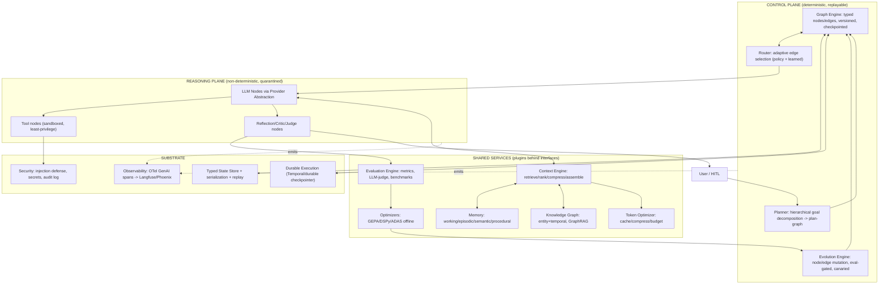

# Agent Engineering Foundation (AEF): The Definitive Graph-Engineering Scaffold for an Agent Operating System

## TL;DR
- **Build AEF as a two-plane Agent Operating System**: a *deterministic control plane* (an explicit, typed, versioned graph/state-machine engine) wrapped around a *non-deterministic reasoning plane* (LLM nodes), with a *durable execution substrate* underneath. The winning pattern from production (OpenAI Codex on Temporal, Google ADK 2.0's workflow runtime) is graph-for-reasoning + durable-execution-for-orchestration; AEF should own a thin graph IR and treat durability, memory, knowledge graph, and evaluation as pluggable services behind stable interfaces.
- **Only five things differ per agent** — Knowledge, Policies, Tools, Objectives, and Evaluation Metrics — while Planning, Graph, Memory, Evaluation harness, Reflection, Optimization, Knowledge-Graph access, Observability, Security, Token/Context engineering, and Continuous Learning are all inherited from one universal scaffold. This is the single most important design decision and is directly implementable as a directory + config + interface contract.
- **Self-improvement must be evaluation-gated, archive-based, and canaried** — every execution emits traces that feed offline optimizers (GEPA/DSPy for prompts, ADAS/AgentSquare/Darwin-Gödel-style search for graph topology), but no self-modification reaches production without passing a held-out eval gate, a stratified canary rollout, and one-click rollback. Treat prompt injection as unsolved and contain via least-privilege + sandboxing + human-in-the-loop for irreversible actions.

## Key Findings

1. **No single framework is sufficient; the strongest architecture is a layered composition.** LangGraph gives graph-native agent reasoning but its checkpointer only persists *between* nodes, not inside them, and a run dies with its process. Temporal gives durable, replayable, crash-proof execution but has no concept of prompts or context. The production consensus (used by OpenAI for Codex) is to run both: durable execution as the outer orchestrator, graph reasoning as the inner loop. AEF should define its own thin graph IR and adapt to either backend rather than marrying one framework.

2. **Graph-native + deterministic is now mainstream, not exotic.** Google ADK 2.0 shipped a graph-based Workflow Runtime with routing, fan-out/fan-in, loops, retry, and nested workflows; Microsoft's Agent Framework (GA reported April 2026, merging AutoGen + Semantic Kernel) added type-safe graph workflows; CrewAI added deterministic "Flows"; PydanticAI ships `pydantic-graph` (a typed finite-state-machine). AEF is aligned with where the whole industry is converging, and can borrow the best of each.

3. **Context engineering beats prompt engineering, and "more context" actively hurts.** Chroma's "Context Rot" research (Kelly Hong, Anton Troynikov, Jeff Huber; July 14, 2025), evaluating GPT-4.1, Claude 4, Gemini 2.5, and Qwen3, found that "models do not use their context uniformly; instead, their performance grows increasingly unreliable as input length grows" — and, counterintuitively, "models perform better on shuffled haystacks than on logically structured ones." Anthropic's guidance is to find "the smallest possible set of high-signal tokens." This makes context curation, compression, and just-in-time retrieval first-class subsystems, not afterthoughts.

4. **Memory has converged on hybrid vector + temporal knowledge graph.** Per Mem0's ECAI 2025 paper (arXiv:2504.19413), Mem0 delivered "a 26% relative uplift in overall LLM-as-a-Judge score over OpenAI's memory feature—66.9% versus 52.9%," with "91% reduction in p95 total latency (1.44s vs 17.12s)" and ~90% fewer tokens (~1.8K vs ~26K per conversation); its April 2026 token-efficient algorithm reportedly "hits 92.5 on LoCoMo, 94.4 on LongMemEval ... while averaging under 7,000 tokens per retrieval call." Zep/Graphiti offers a temporal KG (strong on temporal reasoning; SOC2/HIPAA/GDPR); Letta/MemGPT offers OS-style paging. Scores are contested and non-comparable across harnesses, so AEF should abstract memory behind an interface.

5. **Self-improvement works when it is language-native and evaluation-gated.** Per Agrawal et al., GEPA (arXiv:2507.19457, ICLR 2026 Oral): "Across four tasks, GEPA outperforms GRPO by 10% on average and by up to 20%, while using up to 35x fewer rollouts" (GRPO baseline = 24,000 rollouts), and "outperforms the leading prompt optimizer, MIPROv2, by over 10%." Reflexion converts scalar feedback into verbal lessons; Voyager accumulates a reusable skill library. ADAS/AgentSquare/Darwin Gödel Machine extend this to searching the agent architecture itself, with the DGM's *archive* being the key safety/quality mechanism.

6. **Multi-agent is frequently the wrong default.** Per Anthropic's "How we built our multi-agent research system," "a multi-agent system with Claude Opus 4 as the lead agent and Claude Sonnet 4 subagents outperformed single-agent Claude Opus 4 by 90.2% on our internal research eval," but such systems "use about 15× more tokens than chats," and "token usage by itself explains 80% of the variance" on BrowseComp. Cognition ("Don't Build Multi-Agents") argues context fragmentation makes parallel writers unreliable; their working pattern is *multiple readers, single-threaded writer*. AEF's default should be single-agent-with-subagent-readers, escalating to full multi-agent only for parallelizable, read-heavy, breadth-first work.

## Details

### 1. Executive Summary
AEF is an **Agent Operating System**: a reusable, repo-agnostic scaffold that every specialized agent (Cyber/Azure/Red-Purple Team, Bug Hunting, Procurement, Federal Contracting, Research, SWE, Autonomous Coding, Sales, Healthcare, Financial, Data Mining, Swarms, HITL) inherits wholesale. It is graph-native (execution is an explicit typed graph), deterministic (the control plane is replayable and side-effect-free; only LLM nodes are non-deterministic and are quarantined), vendor-neutral (models sit behind a provider interface: OpenAI, Anthropic, Gemini, Llama, DeepSeek, Qwen, Mistral, local), and continuously self-improving (every run is scored and feeds optimizers, gated by evals).

The core thesis: **separate the deterministic orchestration graph from the non-deterministic reasoning, and make everything else a plugin behind a stable interface.** This is what lets one scaffold serve thousands of agents through a decade of model churn.

### 2. Complete Architecture Diagram (Mermaid)



### 3. Layered Agent Operating System
- **L0 Substrate**: durable execution, typed state store, OTel observability, secrets/audit.
- **L1 Graph Kernel**: nodes, edges, typed state, checkpointing, replay, versioning, composition.
- **L2 Cognitive Services**: memory, knowledge graph, context engine, token optimizer.
- **L3 Reasoning**: provider-abstracted LLM nodes, planner, reflection/critic/judge.
- **L4 Improvement**: evaluation engine, offline optimizers, evolution engine (gated).
- **L5 Agent Definitions**: per-agent Knowledge/Policies/Tools/Objectives/Metrics.
- **L6 Coordination**: multi-agent supervisor/worker, MCP/A2A protocols, HITL.

### 4. Universal Graph Scaffold
A node is a pure-ish function `(State, Context, Services) -> StateDelta + Route`. Edges are typed and declared statically (deterministic topology) with a small set of dynamic-routing nodes for LLM-driven branching. Every graph is versioned (semver), serializable (JSON/protobuf IR), diffable, testable in isolation, and composable (subgraphs as nodes). This inherits PocketFlow's minimalist Node(prep→exec→post)+Flow model, Burr's state-machine determinism/replay, and LangGraph's ergonomics, while avoiding LangGraph's in-node durability gap. Recommended reference directory:

```
aef/
  kernel/            # graph engine, node/edge, state, checkpoint, replay
  state/             # typed schemas, serialization, versioning
  providers/         # openai, anthropic, gemini, llama, deepseek, qwen, mistral, local
  services/
    memory/          # mem0, graphiti, letta adapters behind MemoryStore
    kg/              # neo4j, falkordb, memgraph behind GraphStore
    context/         # retrieve, rank, prune, compress, assemble
    tokens/          # caching, llmlingua compression, budgets
    eval/            # deepeval, ragas, promptfoo, benchmark runners
    optimizers/      # gepa, dspy, adas adapters
  reasoning/         # planner, critic, judge, reflection
  evolution/         # mutation, archive, canary, rollback, gates
  observability/     # otel genai instrumentation, exporters
  security/          # injection defense, sandbox, policy engine, audit
  coordination/      # supervisor/worker, mcp, a2a, hitl
  agents/
    _base/           # the universal scaffold every agent inherits
    azure_sec/       # only knowledge/policies/tools/objectives/metrics
    red_team/
    ...
  config/            # yaml plugin wiring + per-agent config
  CLAUDE.md          # scaffold contract for Claude Code
```

### 5. Universal Shared State Specification (typed schema)

```python
from pydantic import BaseModel
from typing import Literal
from datetime import datetime

class Provenance(BaseModel):
    node_id: str
    graph_version: str
    model: str | None = None
    ts: datetime
    trace_id: str            # OTel trace id
    token_cost: int = 0

class Message(BaseModel):
    role: Literal["system","user","assistant","tool"]
    content: str
    prov: Provenance

class Plan(BaseModel):
    goal: str
    subgoals: list["Plan"] = []
    status: Literal["pending","active","done","failed"] = "pending"
    reusable_key: str | None = None   # for planning memory promotion

class AEFState(BaseModel):
    run_id: str
    agent_id: str
    objective: str
    messages: list[Message] = []
    plan: Plan | None = None
    working_memory: dict = {}          # bounded scratchpad
    context_budget_tokens: int = 8000
    retrieved_context: list[dict] = [] # ranked, compressed
    tool_results: list[dict] = []
    reflections: list[str] = []        # verbal lessons (Reflexion)
    scores: dict[str, float] = {}      # eval metrics
    errors: list[dict] = []            # failure memory
    checkpoint_seq: int = 0
    provenance: list[Provenance] = []
```

State is append-mostly, checkpointed per node, and fully replayable. Serialization is schema-versioned to let graphs evolve without breaking old checkpoints (a lesson from ADK 2.0's breaking session-schema change, where 2.0 sessions were incompatible with 1.x).

### 6. Universal Planning Graph
Hierarchical goal decomposition produces a *plan-graph* (a subgraph), not just a task list. Plans are stored in **planning memory** with a `reusable_key`; successful plan-graphs are promoted to templates. Adaptive/dynamic planning re-decomposes on failure using reflection output. Constraint and risk planning are policy nodes that prune illegal or high-blast-radius branches before execution — critical for the requester's security/red-team agents. Meta-planning selects *which* planning strategy to use per objective class.

### 7. Universal Memory Architecture (CoALA-grounded)
Following CoALA's taxonomy (arXiv:2309.02427) — working, episodic, semantic, procedural — plus AEF-specific stores:
- **Working**: bounded scratchpad in State.
- **Episodic**: past run traces ("what happened when I tried X").
- **Semantic**: facts, stored in the knowledge graph with temporal validity.
- **Procedural**: reusable skills/plan-templates (Voyager-style skill library).
- **Failure/Success memory**: explicit stores feeding reflection and routing.
- **Optimization memory**: prompt/graph variants and their scores.

Backend is pluggable: Mem0 (cheapest tokens), Zep/Graphiti (temporal KG, compliance), or Letta (OS-paging). Store *when*: after every node (working), on run completion (episodic), on verified facts (semantic), on eval-passing skills (procedural). AEF should default to a Graphiti-style temporal KG for semantic+episodic because temporal validity intervals prevent stale-fact bugs, with Mem0-style extraction to keep retrieval token cost low. Note CoALA's documented gap: it does not distinguish persistence semantics of semantic vs episodic memory, so AEF should add explicit update/decay/ownership rules per store.

### 8. Universal Self-Improvement Architecture
Every execution → trace → eval score → optimizer, at three cadences:
- **Fast (in-run)**: Reflexion (arXiv:2303.11366) / Self-Refine (arXiv:2303.17651) — verbal lessons appended to State, then retry.
- **Medium (offline, per-batch)**: GEPA/DSPy optimize prompts against held-out sets. GEPA is preferred (reflective, Pareto-based, ~35× fewer rollouts than RL).
- **Slow (governed)**: ADAS/AgentSquare-style search over graph topology; Darwin-Gödel-style archive of agent variants.

Reflexion's own ablation shows self-reflection adds an ~8% absolute boost over episodic-memory learning alone — evidence that verbal lessons, not just stored traces, drive improvement.

### 9. Universal Reflection Architecture
Dedicated critic and judge nodes, separated: the critic gives verbal feedback; the judge gives scores. LLM-as-judge with an explicit rubric, run on canary traffic. Reflection output is structured and written to failure/success memory so lessons persist across runs, not just within a run.

### 10. Universal Evaluation Architecture
Every graph execution is scored. Component evals (DeepEval, Ragas for RAG, Promptfoo for prompt regression) + end-to-end agent benchmarks: SWE-bench Verified (coding, real GitHub issues), GAIA (assistant, multi-step tool use), tau-bench (policy-compliant tool use — measures whether the agent complies with business policy, a dimension absent from SWE-bench/GAIA), WebArena/OSWorld (browser/computer use). Public benchmark → production drops of 20-40 points are routine, so private evals on the requester's own task distribution are the true production-readiness signal. Eval gates block promotion of any self-modification.

### 11. Universal Graph Evolution Engine
Automatic node/edge generation, pruning, merging, specialization, and mutation — all **eval-gated, canaried, and rollback-able**. Safety rails (mandatory):
- **Archive-based rollback** (Darwin Gödel Machine, arXiv:2505.22954): keep every agent/graph variant in an archive; the DGM finding is that less-performant ancestors are stepping stones and rollback points, avoiding premature convergence (SWE-bench 20.0%→50.0%, Polyglot 14.2%→30.7%, run with sandboxing + human oversight).
- **Evaluator gating** (AlphaEvolve, arXiv:2506.13131): objective automatic evaluation filters incorrect LLM suggestions; only verified improvements integrate. AlphaEvolve restricts itself to domains where candidates are automatically and objectively verifiable — a scoping safeguard AEF should copy.
- **Seesaw/no-regression constraint**: reject any edit that regresses even one previously-solved task (from harness-evolution research).
- **Canary rollout + auto-rollback**: 5% traffic, stratified by tenant tag (internal → beta → enterprise) so power-law "whale" traffic doesn't dominate; gate on percentiles not means (canonical failure: mean Groundedness 0.91 while a sub-route sits at 0.62); keep v(n-1) warm ≥24h to avoid cold-start on rollback.
- **Cumulative-drift monitoring**: track accumulated sub-threshold edits — a documented failure mode where five compliant edits produced a 6th-edit −14% regression.
- **Human-in-the-loop** approval above a risk threshold; signed release manifests; main-lineage status assigned by external evidence, not self-promotion.

### 12. Universal Context Engineering Engine
Pipeline: retrieve → rank → prune → compress → assemble, under a per-node token budget. Prefer just-in-time retrieval (Anthropic) over pre-stuffing. Hierarchical retrieval (graph → community summary → node). Context decay/pruning to fight context rot. Every node receives only the minimal high-signal set; because performance degrades well before the window fills, safe context budgets should target ~150-400k tokens for high-accuracy work even on 1-2M-token models. Use Anthropic harness patterns for long-running agents: externalize progress to files (a `claude-progress.txt`-style artifact plus git history), and use a different first-context-window prompt to set up the environment.

### 13. Universal Token Optimization Engine
Maximize *intelligence per token*, never merely minimize tokens. Layers: provider prompt caching (Anthropic/OpenAI/Google prefix caches; note a documented two-tier cache threshold near ~3,500 tokens), semantic caching (GPTCache/Redis for repeated queries), prompt compression (LLMLingua/LongLLMLingua, arXiv:2310.05736 — up to 20× with a budget controller; LLMLingua-2 for task-agnostic, 3-6× faster), KV-cache reuse, and per-node token budgets. Key tension: query-aware compression produces a different prefix per query and thus breaks prefix caching, so co-design compression and caching rather than stacking them naively. First step before any optimization: instrument token logging on every call to establish a baseline.

### 14. Universal Knowledge Graph Architecture
Graph memory replaces flat vector memory for multi-hop/relational queries. GraphRAG family:
- **Microsoft GraphRAG** (arXiv:2404.16130): hierarchical community summaries; achieved comprehensiveness win rates of 72-83% and diversity win rates of 62-82% (p<.001) over vector RAG on query-focused summarization, with top-level community summaries using "up to 97% fewer tokens than processing the source text directly." Weakness: expensive full re-indexing on new documents.
- **LightRAG**: incremental updates, dual-level retrieval, ~30% lower latency.
- **HippoRAG**: PageRank-based, 10-30× cheaper multi-hop reasoning.
- **nano-graphrag**: lean top-k community selection.

Backend: Neo4j (richest ecosystem, RBAC/clustering — the "boring" enterprise base case; disk-based, handles graphs beyond RAM), Memgraph (in-memory, lowest latency, RAM-bound, BSL license), FalkorDB (GraphBLAS + HNSW vector search, fastest reads in third-party benchmarks, GraphRAG-oriented), Kuzu (embedded — but archived October 2025, avoid for new builds). Target Neo4j for enterprise/Azure deployments and FalkorDB for latency-critical embedded use, behind a common `GraphStore` interface.

### 15. Universal Multi-Agent Architecture
Default to **orchestrator + read-only subagents** (Anthropic's orchestrator-worker pattern; Cognition's "single-threaded writer"). Roles: Supervisor/Planner/Research/Critic/Judge/Verifier/Worker/Tool/Memory agents. Escalate to full parallel multi-agent only for breadth-first, parallelizable, read-heavy tasks where the ~15× token cost is justified. Coordination via MCP (agent→tools, now under the Linux Foundation with 18,000+ community-indexed servers), A2A (agent→agent, donated to Linux Foundation with a broad partner set), and ACP/AGNTCY-OASF (messaging/discovery). Cognition's Principle 1: share full agent traces, not just messages. Multi-agent is the *wrong* choice for tasks needing shared context or with many inter-agent dependencies — Anthropic themselves note teams "invest months building elaborate multi-agent architectures only to discover that improved prompting on a single agent achieved equivalent" results.

### 16. Universal Plugin Architecture
Dependency injection everywhere. Stable interfaces: `ModelProvider`, `MemoryStore`, `GraphStore`, `Retriever`, `Evaluator`, `Tracer`, `Tool`, `Optimizer`, `DurabilityBackend`. Plugins discovered via entry-points and configured in YAML:

```yaml
# config/agent.azure_sec.yaml
extends: _base
model_provider: {impl: anthropic, model: claude-sonnet, fallback: [gpt, local-llama]}
memory: {impl: graphiti, backend: neo4j}
knowledge_graph: {impl: neo4j, ontology: azure_security.ttl}
evaluator: {suites: [private_azure_pentest, tau_bench_policy]}
tools: {allow: [az_cli_ro, kql_query], sandbox: gvisor, creds: managed_identity}
policies: {require_hitl_above_risk: 0.7, forbid: [resource_delete]}
objectives: "Identify misconfigurations and privilege-escalation paths (read-only)."
```

This is what makes AEF repo-agnostic and drop-in for any existing agent repo.

### 17. Universal Observability Architecture
Instrument once with **OpenTelemetry GenAI semantic conventions** (`gen_ai.*` spans for model calls, agent runs, tool executions, retrieval, and memory ops; plus the newer Agent Spans and MCP conventions). Export via OTel Collector to Langfuse/Phoenix/Braintrust/Grafana/Jaeger. One agent run = one trace across process/worker boundaries by propagating trace context (as the Temporal+LangSmith integration does across Workflow/Activity boundaries). Node metrics, graph metrics, and execution replay all derive from the trace store. Use the spec's three-mode content-capture design to balance privacy vs debuggability; overhead is <1% due to async batch export. As of 2026 most GenAI conventions are still experimental — use `OTEL_SEMCONV_STABILITY_OPT_IN` dual-emission during transitions.

### 18. Universal Deployment Architecture (Azure-aware)
Containerized nodes, a durable-execution backend, and the graph IR in a registry. Azure patterns for the requester: Azure Container Apps/AKS for workers, Azure Key Vault for secrets, Managed Identities for least-privilege tool credentials, Azure Monitor/App Insights bridged to OTel, Azure AI Foundry for model hosting (and Microsoft Agent Framework interop). Security stack: instruction hierarchy (system > user > tool output), structured-output/JSON-schema validation before acting, tool sandboxing, canary tokens as exfiltration tripwires, a deterministic policy engine before high-impact actions, and a full audit log. Treat prompt injection as a possibly-permanent architectural property — contain, don't filter. Teleport research cited a 17% incident rate for orgs enforcing least-privilege on agents vs 76% without it; recent CVEs in coding agents (e.g., Cursor and Claude Code entries in 2026) confirm injection-to-execution is a real, not theoretical, risk.

### 19. Phase-by-Phase Implementation Roadmap
- **Phase 0 (weeks 1-2)**: Graph kernel + typed State + checkpointing + OTel token logging. Single provider.
- **Phase 1 (weeks 3-6)**: Provider abstraction (multi-model + fallback), tool interface + sandboxing, memory interface (Mem0 default), basic eval harness.
- **Phase 2 (weeks 7-12)**: Knowledge graph + GraphRAG, context engine, token optimizer, hierarchical planner.
- **Phase 3 (months 4-5)**: Reflection/critic/judge, offline GEPA/DSPy optimization, private eval suites per agent.
- **Phase 4 (months 6-8)**: Evolution engine with full safety rails (archive, canary, rollback, seesaw gate).
- **Phase 5 (months 9-12)**: Multi-agent coordination (MCP/A2A), HITL, durable execution at scale, first vertical agents (Azure Security / Red Team), then prediction-trading and profit-analyzer verticals reusing the same scaffold.

### 20. Top GitHub Repositories (with architectural placement)
- github.com/langchain-ai/langgraph — graph reasoning reference (L1 patterns).
- github.com/temporalio/temporal — durable execution substrate (L0).
- github.com/google/adk-python — graph workflow runtime reference (L1).
- github.com/pydantic/pydantic-ai — typed graph + DI (L1/L16).
- github.com/DAGWorks-Inc/burr — state-machine determinism/replay (L1).
- github.com/The-Pocket/PocketFlow — minimalist zero-dep graph core (L1).
- github.com/openai/openai-agents-python — agent/tool loop + guardrails + tracing (L3).
- github.com/huggingface/smolagents — code-action agents, ~1k-line core (L3).
- github.com/crewAIInc/crewAI — role-based multi-agent + deterministic Flows (L15).
- github.com/microsoft/LLMLingua — prompt/KV compression (L13).
- github.com/gepa-ai/gepa (+ CerebrasResearch/gepa) — reflective prompt optimizer (L4).
- github.com/stanfordnlp/dspy — declarative pipeline optimization, MIPROv2/GEPA (L4).
- github.com/getzep/graphiti — temporal KG memory (L7/L14).
- github.com/mem0ai/mem0 — token-efficient memory (L7).
- github.com/letta-ai/letta — OS-style memory runtime (L7).
- github.com/microsoft/graphrag — hierarchical GraphRAG (L14).
- github.com/HKUDS/LightRAG — incremental GraphRAG (L14).
- github.com/OSU-NLP-Group/HippoRAG — PageRank multi-hop (L14).
- github.com/neo4j/neo4j, github.com/FalkorDB/FalkorDB, github.com/memgraph/memgraph — graph DBs (L14).
- github.com/open-telemetry/semantic-conventions-genai — observability standard (L17).
- github.com/langfuse/langfuse, github.com/Arize-ai/phoenix — tracing/eval (L10/L17).
- github.com/confident-ai/deepeval, github.com/explodinggradients/ragas, github.com/promptfoo/promptfoo — evaluation (L10).
- github.com/jennyzzt/dgm — archive-based self-improvement (L11).
- github.com/ShengranHu/ADAS — automated agent design (L11).
- github.com/modelcontextprotocol — MCP servers/spec (L15).
- github.com/The-Swarm-Corporation/AdvancedResearch — orchestrator-worker reference impl (L15).

### 21. Top Academic Papers (with relevance)
- CoALA: Cognitive Architectures for Language Agents — Sumers et al., 2023, arXiv:2309.02427 (memory taxonomy backbone).
- Reflexion — Shinn et al., 2023, arXiv:2303.11366 (verbal RL, in-run improvement).
- Self-Refine — Madaan et al., 2023, arXiv:2303.17651 (iterative self-feedback).
- Voyager — Wang et al., 2023, arXiv:2305.16291 (procedural skill library).
- ReAct — Yao et al., 2022, arXiv:2210.03629 (reason+act loop).
- GEPA — Agrawal et al., 2025, arXiv:2507.19457 (reflective prompt evolution; medium loop).
- ADAS — Hu et al., 2024, arXiv:2408.08435 (automated agent design).
- AgentSquare — 2024, arXiv:2410.06153 (modular agent search space).
- Darwin Gödel Machine — Zhang et al., 2025, arXiv:2505.22954 (archive-based self-improvement).
- AlphaEvolve — Novikov et al., 2025, arXiv:2506.13131 (evaluator-gated evolution).
- LLMLingua — Jiang et al., 2023, arXiv:2310.05736 (prompt compression).
- LongLLMLingua — Jiang et al., 2024, ACL (long-context compression).
- Zep: temporal KG memory — Rasmussen et al., 2025, arXiv:2501.13956.
- Mem0 — Chhikara et al., 2025, arXiv:2504.19413 (ECAI 2025).
- GraphRAG (Local to Global) — Edge et al., 2024, arXiv:2404.16130.
- GPTSwarm — 2024 (agents as optimizable graphs).
- G-Designer — arXiv:2410.11782 (GNN-designed communication topologies).

### 22. Enterprise Reference Architectures
Anthropic multi-agent research system (orchestrator-worker; +90.2% vs single agent; ~15× tokens; separate CitationAgent pass); OpenAI Codex on Temporal (durable coding agents at production scale — Temporal Cloud reports 9.1T lifetime action executions); Google ADK on Vertex AI; Microsoft Agent Framework on Azure AI Foundry (AutoGen + Semantic Kernel successor); Cognition Devin (single-threaded writer, context engineering over parallel agents).

### 23. Technology Comparison Matrices
- **Orchestration**: LangGraph (ergonomic, weak in-node durability) / Temporal (durable+replayable, no LLM concepts) / ADK 2.0 (graph+deterministic, Google-cloud pull) / MS Agent Framework (enterprise+OTel, Azure pull) / Burr (deterministic FSM+replay, small community) / PocketFlow (minimal+portable, no ops) / PydanticAI (typed FSM+DI+durable) / CrewAI (Crews non-deterministic; Flows deterministic) / SmolAgents (code-actions, no graph/persistence).
- **Memory**: Mem0 (cheap tokens, consumer) / Zep-Graphiti (temporal, compliant/regulated) / Letta (OS-paging, autonomous, lock-in).
- **Graph DB**: Neo4j (ecosystem/RBAC) / Memgraph (latency, RAM-bound) / FalkorDB (vectors+speed, AI-oriented) / Kuzu (embedded, archived — avoid).
- **GraphRAG**: MS GraphRAG (accuracy/global, costly reindex) / LightRAG (incremental) / HippoRAG (cheap multi-hop).
- **Prompt/agent opt**: GEPA (reflective, few rollouts) / DSPy (whole-pipeline compile) / TextGrad (instance-level textual gradients) / OPRO/APE (single-prompt) / ADAS-AgentSquare (architecture search).

### 24. Risk Analysis
Prompt injection (unsolved — contain, don't filter); self-modification instability (eval-gate + archive + cumulative-drift monitor); context rot (curate + budget); multi-agent cost/fragmentation (default single); vendor lock-in (interfaces + fallback providers); benchmark-to-production gap (private evals mandatory); dependency abandonment (Kuzu precedent — choose maintained backends); memory-poisoning persistence (validate before write, TTL/decay).

### 25. Tradeoff Analysis
Determinism vs flexibility (quarantine non-determinism to LLM nodes only); durability vs latency (durable backend only for long/side-effecting runs — Temporal earns its keep past ~1hr or high restart cost); token cost vs quality (intelligence-per-token, not minimization); graph expressiveness vs analyzability (static topology + few dynamic routing nodes); memory richness vs latency/cost (temporal KG ~50-150ms traversal vs ~10-50ms vector-only); compression vs caching (mutually antagonistic — co-design).

### 26. Future Research Opportunities
Metacognitive self-improvement (agents that monitor their own learning progress); co-evolving agents + evaluators (Red Queen Gödel Machine, arXiv:2606.26294); cumulative-drift-safe evolution; graph-native context assembly; provably-safe self-modification (Gödel-machine lineage with signed manifests + goal-integrity constraints); automatic ontology design for domain agents; dynamic-graph RAG with event-centric temporal reasoning.

### 27. Final Recommended Architecture for AEF v2.0
A two-plane, six-layer Agent OS: a deterministic, typed, versioned graph kernel + quarantined LLM reasoning, over a durable substrate, with memory / knowledge-graph / context / token / evaluation / observability exposed as dependency-injected plugins behind stable interfaces; a universal scaffold inherited by all agents where only Knowledge, Policies, Tools, Objectives, and Metrics differ; and an evaluation-gated, archive-based, canaried evolution engine with cumulative-drift monitoring and one-click rollback. Default to single-agent-with-readers; escalate to multi-agent only with written justification (parallelizable + read-heavy + cost-tolerant). OpenTelemetry GenAI observability throughout; least-privilege + sandboxing + policy-gating + HITL for security. Ship phase by phase, gating every change on private evals.

## Recommendations
1. **Start with the graph kernel and typed state (Phase 0).** Do not adopt a heavyweight framework wholesale; build a thin graph IR + adapter layer so you can swap LangGraph/Temporal/ADK underneath. *Change trigger*: if a single run must survive worker restarts or exceed ~1 hour of wall-clock, add a durable backend (Temporal-style) — otherwise a Postgres checkpointer suffices.
2. **Make memory and knowledge graph pluggable from day one.** Default Mem0 for cost; switch to a Graphiti temporal KG when temporal reasoning or compliance (HIPAA/GDPR/SOC2) matters — directly relevant to the Healthcare, Financial, and Federal Contracting agents. Never hardcode a memory vendor.
3. **Adopt OTel GenAI conventions before building optimizers.** *Threshold*: instrument token logging on every model call as the very first observability step — you cannot improve or cost-optimize what you cannot trace.
4. **Gate all self-improvement on private evals + canary + rollback.** Do not enable autonomous graph evolution until Phase 4, and only behind the full safety-rail set. *Change trigger*: enable a given mutation class only after it passes the seesaw no-regression constraint on your private suite for N consecutive batches, and add cumulative-drift monitoring to catch slow degradation.
5. **Default to single-agent; require written justification before any multi-agent escalation.** The bar is: task is parallelizable, read-heavy, and tolerant of ~15× token cost. For write-heavy or shared-context tasks (most coding), stay single-threaded-writer.
6. **For the requester's security work specifically**: enforce least-privilege tool credentials via Azure Managed Identities, sandbox all tool execution (gVisor/containers), add deterministic policy-engine gates before any state-changing action, use canary tokens as exfiltration tripwires, and log everything for audit. Assume some injections will land and ensure containment limits blast radius.

## Caveats
- Many 2026 datapoints (GitHub star counts, Microsoft Agent Framework GA date, CrewAI/SmolAgents star counts, some benchmark percentages) come from secondary blogs/aggregators and vary between sources; verify live via the GitHub API and primary docs before publishing scaffolding docs.
- Memory benchmark scores (Mem0 vs Zep vs Letta) are non-comparable across harnesses — each vendor uses its own judge model, answer model, and question subset; a model swap alone moved LOCOMO scores ~10 points. Treat all such numbers as directional, not authoritative, and re-run on your own tasks.
- The original draft's "GraphRAG 86% vs 32%" figure was not supported by the primary source and has been replaced with Edge et al.'s published win-rate and token-reduction figures.
- AlphaEvolve remained limited-access with no official public DeepMind repo as of the sources (only third-party reimplementations like OpenEvolve); DGM/HarnessX/Red-Queen safety patterns are from preprints, not battle-tested production standards — adopt their *patterns* (archive, evaluator gate, no-regression, signed release) rather than their code.
- Prompt injection is described by multiple 2026 sources as possibly a permanent architectural property; the security posture must assume some injections will land, which is why containment (least-privilege, sandbox, HITL) — not detection alone — is the load-bearing control.